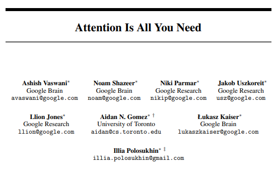
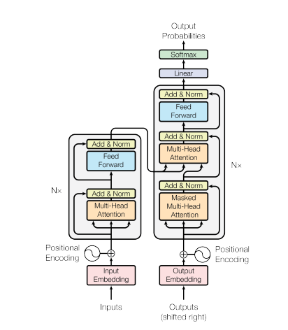
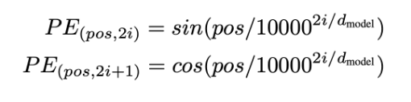

# Transformer-scratch
### Pytorch Implementation of Transformer Model Presented on ["Attention Is All You Need"](https://arxiv.org/pdf/1706.03762.pdf)
</img>

## The Transformer - Model Architecture
- Encoder-Decoder Structure
- Encoder consists of Encoder Block and Decoder consists of Decoder Blocks (in paper: 6 stacks each) <br>
</img>

## (1) Embedding - Positional Embedding
- Transformer assumes sequential data (seq2seq input-output structure) but Multi-Head Attention inherently lacks information about locality and order.
- Inputs for Encoder (also for Decoder) should first enter Positional Embedding Layer so the input tokens contains information about relative order.
- Note that Positional Embedding (Encoding) vectors are not variables. Same location in the positional embedding vector should always contain same value regardless of samples or batches
- Since Sine function is a periodic function, to avoid different location in a positional embedding vector sharing a same value, Cosine is also employed.
- Positional Embedding Vectors calculated from below formulation are added to inputs of Encoder and Decoder <br>
</img><br>

```python
class PositionalEmbedding(nn.Module):
    def __init__(self, max_len, d_model, device):
        super(PositionalEmbedding, self).__init__()

        self.encoding = torch.zeros(max_len, d_model, device=device)
        self.encoding.requires_grad = False

        _t = torch.arange(0, max_len, device=device)
        _t = _t.float().unsqueeze(dim=1)
        _i = torch.arange(0, d_model, step=2, device=device).float()

        self.encoding[:, 0::2] = torch.sin(_t / 10000 ** (_i / d_model))
        self.encoding[:, 1::2] = torch.cos(_t / 10000 ** (_i / d_model))

    def forward(self, x):
        ## input shape: [batch_size(N), length(L), embed_size(d_model)]
        N, L = x.size()

        return self.encoding[:L, :]
```

#### To Be Updated

## (2) Multi-Head Attention
 <br>
- Left figure shows the mechanism of Scaled Dot-Product Attention, which we will use.<br>
Unlike the case of Encoder block, in Decoder block, we need the 'Mask' layer to maken values in <b>Unseen Tokens</b> to have impact on Attention operation. Transformer here is a sequence-to-sequence model and the decoder should not be given any information about later coming tokens during attention operation.
- Right figure is described in *MultiHeadAttention class* in MultiHeadAttention.py file. Let's take a look with the code.
```python
class PositionalEmbedding(nn.Module):
    def __init__(self, max_len, d_model, device):
        super(PositionalEmbedding, self).__init__()

        self.encoding = torch.zeros(max_len, d_model, device=device)
        self.encoding.requires_grad = False

        _t = torch.arange(0, max_len, device=device)
        _t = _t.float().unsqueeze(dim=1)
        _i = torch.arange(0, d_model, step=2, device=device).float()

        self.encoding[:, 0::2] = torch.sin(_t / 10000 ** (_i / d_model))
        self.encoding[:, 1::2] = torch.cos(_t / 10000 ** (_i / d_model))

    def forward(self, x):
        ## input shape: [batch_size(N), length(L), embed_size(d_model)]
        N, L = x.size()

        return self.encoding[:L, :]
```

## (3) Encoder Block and Decoder Block

## (4) Encoder

## (5) Decoder

## (6) Transformer


